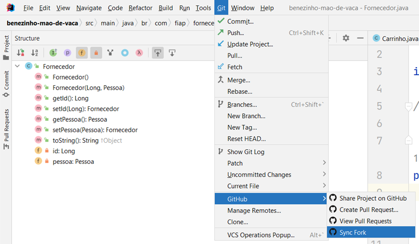
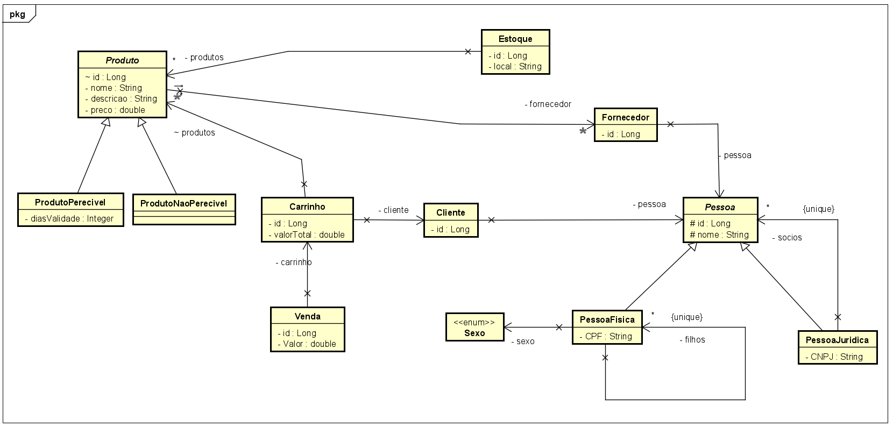

# Armazém do Benezinho 🤓👍🏾

Checkpoint III - Enterprise Application Development aplicada em 22/05/2023.


|                | **Enterprise Application Development** |
|------------------------------------------|----------------------------------------|
| **ALUNO:**                               | **TURMA:** 2TDSPI  - 2TDSPJ            |
| **PROFESSOR:** Benefrancis do Nascimento | 22/05/2023                             |
| **CHECK POINT III**                      | **VALE 10 PONTOS**                     |

# Sumário


[Estudo de caso ](#_Estudo_de_caso)

[O que deverá ser feito? ](#_O_que_devera_ser_feito)

[Diagrama de Classes ](#_Diagrama_de_Classes)

[Como Entregar ](#_Entrega)

[Correção da Prova ](#_Correcao)

<a id="_Estudo_de_caso"></a>

# Estudo de caso

A Holding Benezinho  entrou no ramo de logística, está fornecendo essa atividade para várias empresas.

Contratamos você como Engenheiro de Software para ajudar a construir um sistema capaz de gerenciar o estoque, bem como o carrinho de vendas de produtos para diversas empresas que contratam o serviço de logística do nosso grupo empresarial.

Na sprint atual, você foi incumbido de fazer:

1. O Mapeamento Objeto Relacional das primeiras classes envolvidas neste projeto de software;

2. A criação automatizada das tabelas no banco de dados Oracle;

3. A persistência de todos os dados, e;

4. A criação de dois métodos capazes de realizar consultas as Vendas persistidas previamente:

5. Consulta todos os vendas findAll;

6. Consulta venda pela chave primária findById.


Veja o Diagrama de Classes abaixo (as classes já foram criadas):


<a id="_O_que_devera_ser_feito"></a>

# O que deverá ser feito?


**Você deverá:**

**Fazer o fork do projeto do github, após o professor criar a atividade no Teams,** ( previsto para às 14h do dia 22/05/2023 ). Caso já tenha feito o fork antes dessa data e horário, você deverá fazer o **Synk Fork** conforme imagem abaixo:



https://github.com/Benefrancis/benezinho-mao-de-vaca.git

Caso o github esteja indisponível, você deverá pegar o projeto no diretório compartilhado.


1. **(0,5 Ponto)** acessar o arquivo persistence.xml e alterar as configurações da **persistence-unit** para que seja possível conectar-se ao banco de dados Oracle da FIAP com o seu usuário e senha (manter o seu usuário e senha ativo é sua responsabilidade). Não utilize o usuário e senha de outro aluno. Caso tenha problema para autenticar, comunique o professor.


2. **(1,5 Pontos)** adicionar corretamente as anotações JPA na classe **Carrinho**.

    Lembre-se que:

    1. Existe relacionamento **Muitos para Muitos** entre **Carrinho** e **Produto** no atributo produtos.
    2. Existe relacionamento **Muitos para Um** entre **Carrinho** e **Cliente** no atributo cliente. 


3. **(1 Ponto)** adicionar corretamente as anotações JPA na classe **Cliente**.
    Lembre-se que:

    1. Existe relacionamento **Muitos para Um** entre **Cliente** e **Pessoa** a no atributo pessoa.


4. **(1,5 Pontos)** adicionar corretamente as anotações JPA na classe **Produto**.

    Lembre-se que:

    1. Existe relacionamento **Muitos para Um** entre **Produto** e **Fornecedor** no atributo fornecedor.
    2. A classe **Produto** possui duas classes herdeiras:
      1. **ProdutoPerecivel**;
      2. **ProdutoNaoPerecivel**.


5. **(1 Ponto)** adicionar corretamente as anotações JPA na classe **Estoque**.
   
    Lembre-se que:

    1.  Existe relacionamento **Muitos para Muitos** entre **Produto** e **Estoque** no atributo produtos.


6. **(0,5 Ponto)** adicionar corretamente as anotações JPA na classe **Pessoa**.

    Lembre-se que:

   1. A classe Seguro possui duas classes herdeiras:
      1. Pessoa Física;
      2. Pessoa Jurídica.


7. **(0,5 Ponto)** adicionar corretamente as anotações JPA na classe **PessoaFisica**.

    Lembre-se que:
    
    1. Deverá adicionar uma _ **constraint** _ para que não seja possível ter mais de uma Pessoa Física com o mesmo número de **CPF** na tabela do banco de dados;
    2. Existe relacionamento **Muitos para Muitos** entre **PessoaFisica** e **PessoaFisica** no atributo filhos.


8. **(0,5 Ponto)** adicionar corretamente as anotações JPA na classe **PessoaJuridica**.

    Lembre-se que:
    
    1. Deverá adicionar uma _ **constraint** _ para que não seja possível ter mais de uma Pessoa Jurídica com o mesmo número de **CNPJ** na tabela do banco de dados;
    2. Existe relacionamento **Muitos para Muitos** entre **PessoaJuridica** e **Pessoa** no atributo socios.
   

9. **(1 Pontos)** adicionar corretamente as anotações JPA na classe **Fornecedor**.

    Lembre-se que:
    1. A classe **Fornecedor** possui relacionamento **Muitos para Um** entre **Fornecedor** e **Pessoa** no atributo pessoa. 


10. **(1 Pontos)** adicionar corretamente as anotações JPA na classe **Venda**.

    Lembre-se que:

    1. Existe relacionamento **Muitos para Um** entre **Venda** e **Carrinho** no atributo carrinho.


11. **(0,5 Ponto)** criar um método capaz de consultar uma **Venda** pelo seu identificador na correspondente tabela no banco de dados;

12. **(0,5 Ponto)** criar um método capaz de consultar todos as Vendas na correspondente tabela no banco de dados;


<a id="_Diagrama_de_Classes"></a>

# Diagrama de Classes




<a id="_Entrega"></a>

# Como Entregar

**A entrega deverá ser feita pelo Teams**, porém não se esqueça de fazer o **commit** e **push** do projeto no github.


<a id="_Correcao"></a>

# Correção da Prova

A correção da prova será disponibilizada no github do professor (branch correcao):

Para acessar digite no prompt:

```shell
git clone https://github.com/Benefrancis/benezinho-mao-de-vaca.git && cd benezinho-mao-de-vaca && git checkout correcao
```


A avaliação é individual.


Boa avaliação.